# Godot Bite Sized - World 2D
This repo represents the Godot Bite Sized World - 2D. What is a Bite Sized World - 2D, you might ask? The world object is the game world object being created under my (Godot Bite Sized content series)[https://github.com/timjbruce/godotbitesized]. In this series, I take a 5-10 lesson and make something concrete for developers to follow along / learn about Godot. Second, it is the 2D World object that will be used in games that I create. While most of the items in this series are components that can be re-used within many games. This one, however, is not something that I've componentized - maybe one day!

## Table of Contents

[Build 1](#build-1) - Create the Game World and add a Player component to it

[Build 2](#build-2) - Add the Generator component and generate a simple room

[Build 3](#build-3) - Integrate the updated Generator and Player components

## Build 1
**Build 1 is in Godot 4.5.1**

Build 1 of the World is going to be similar to Build 1 of the Player - _very basic_. This is about a 4 minute project, minus the reading. It's going to contain a world scene and a script that is used to handle global requirements. We'll also copy the Player Build 1 component into this world to see how the two interact. As a note, we're going to paint the player in for this first build. In future builds, we're going to instantiate. Why? I'm keeping the lessons short and sweet so we can see progress and move things along.

At the end of this build, your Scene and FileSystem windows will look like this and you'll have a player moving around in a world!

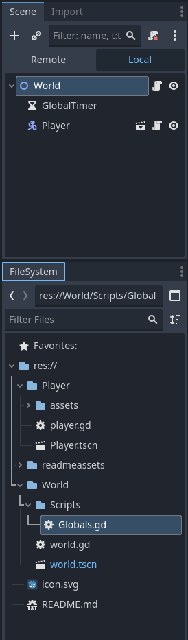

Now, let's start!

The first thing we're going to do is in the scene window, and select the 2D Scene object under "Create Root Node."

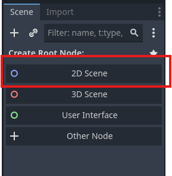

Double Click on the "Node2D" in your Scene window and rename it "World," like so.

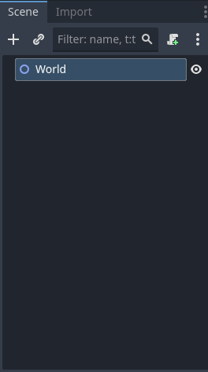

Now, we're going to add a timer node to the world scene. We don't have a use for the timer as of yet, but I like to add one if I know I'm going to use it (**hint:** we will!). After you add it, double click the Timer and rename it "GlobalTimer." Your scene should look like this.

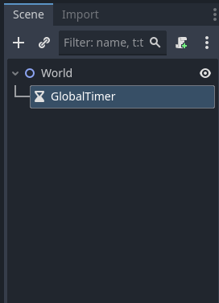

Now, let's save the scene. We're going to create a folder under the project called "World" first. This is used to keep all the assets for the world in one directory, so we can add in our other components over time and not have any overlap. Your FileSystem window will look similar to this, without the "readmeassets" folder (unless you cloned this repo!).

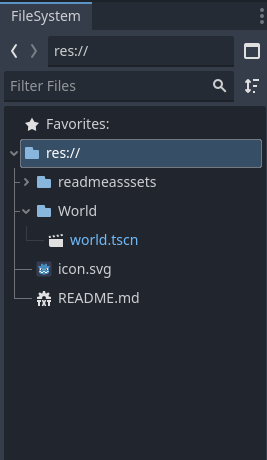

Next, copy the "Player" folder from our Player project into the project. You'll need to do this in Explorer, Command Prompt, Finder, whatever on your system. When you expand "Player" folder, your FileSystem window should look like this.

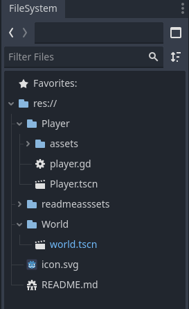

Now, we will select the "Player.tscn" file (the `Player` scene) from the FileSystem and drag it up to the `World` node in the `World Scene` window. This will drop the "Player" component into the world and make it a child of the `World` node.

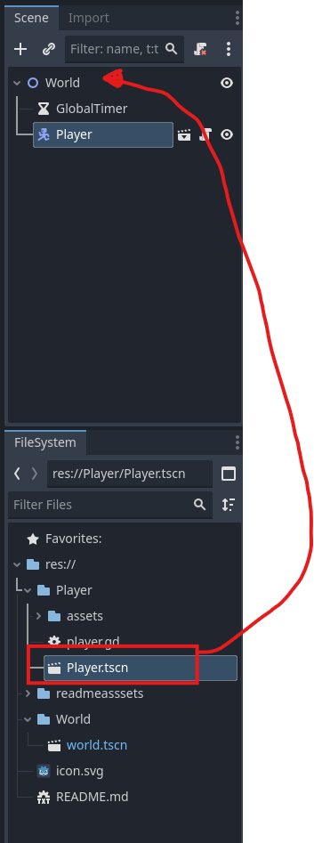

Finally, we need to repeat some steps from the "Player" build to add the input map for the project so we can test this. Let's take care of the input map!

Open the Project Settings dialog by selecting the "Project -> Project Settings..." menu. Click on the "Input Map" tab so we can add new actions. We're going to add actions to move the player "up," "down," "left," and "right" using the arrow keys (or WASD, if you want) and left joystick controller (if you don't have a controller, you can skip this part). Here are the steps for "up" and you can repeat these for the other directions.

Type in "up" for the action and click on the +Add button. This will add the "up" action to the Input Map.

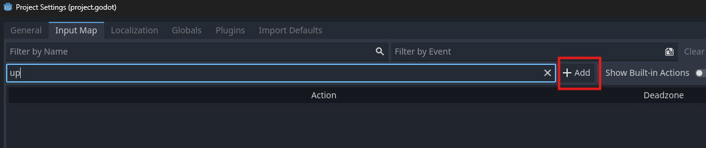

Next, click the "+" next to "up" to open a dialog to add events that can trigger "up" to occur. This dialog box listens for input, making it easy to add the keys. Press the up arrow or W key to add it

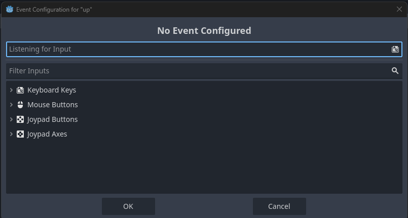

Click the "+" again and now press the left joystick on your controller up to assign it to up, as well

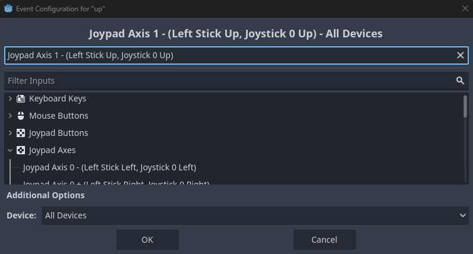

Repeat this process for "down," "left," and "right." The final output should look like this:

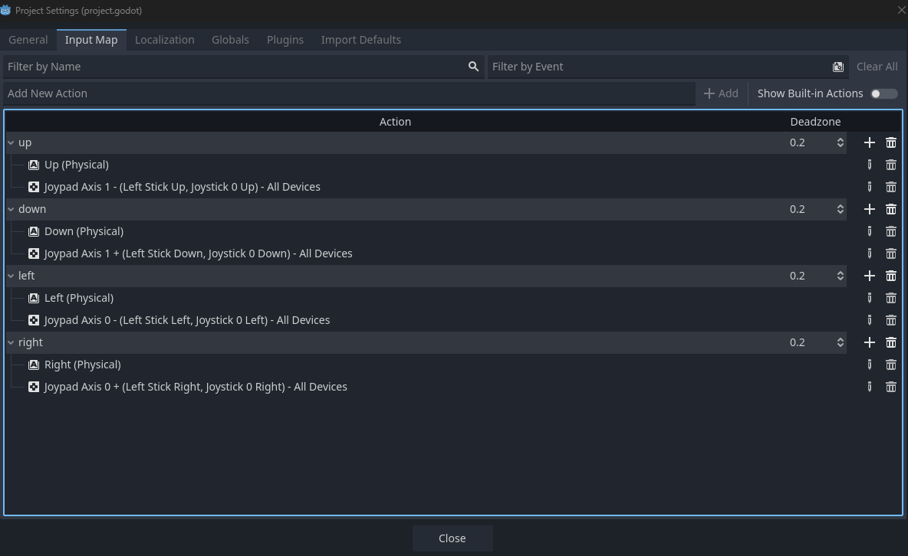

Click the "Close" button to return to the project.

Finally, we're going to add a bit of code to this solution. We're going to create a `Globals` script that will, initially, be pretty sparse. The `Globals` script will eventually allow us to track the different objects with simpler names. It will also allow us to listen for signals that we will be using. In future builds, we aren't going to "paint" objects in. We might want different numbers of enemies. When enemies die, they might drop loot. All of these dynamic items can be hard to track when an object is ready for other objects to subscribe to signals. We're not quite at the point to worry about this functionality, but we want to setup the framework that allows us to manage it now.

You might be asking why do this in a script instead of the `World` node. My simple answer is that this script can be available from all over. There might be a case where you want to do something that doesn't fall within the scope of the `World` node. This separation gives a lot more flexibility should that need arise and saves time from refactoring down the road.

We're going to start by creating a new folder under the `World` folder called `Scripts`. Right click on "World" in the FileSystem, choose "Create New" and  "Folder,"  set the name of the new folder to "Scripts," and click "OK." Your FileSystem window should look like this at the end.

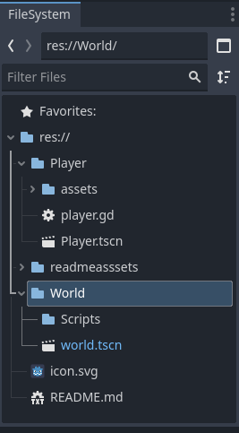

Next, we'll add the script. Right click on the `Scripts` folder in the FileSystem window, choose "Create New" and "Script," change the name to `Globals.gd`, and click "Create." Your FileSystem window should look like the below.

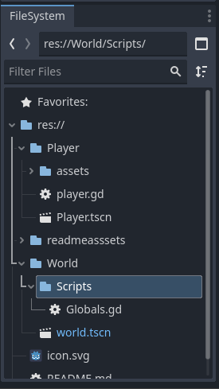

Double-click the script to open it up and copy the following code into the file and save it. You'll note that we're just using it, initially, to capture the nodes for `World`, `GlobalTimer`, and `Player`. These shortcuts allow us to access the objects using a notation of `Globals.object` instead of the `$Tree` notation. This can make a lot of work easier in the future. I know I could have accessed the variables directly in setting these values, but I prefer using setters instead of setting values directly, just in case there is some specific logic I want to see in the setting/storing of a variable. 

```
extends Node

var world: Node2D
var player: player_2d_body
var global_timer: Timer


func set_world(inc_world: Node2D) -> void:
	world = inc_world
	
func set_player(inc_player: player_2d_body) -> void:
	player = inc_player
	
func set_global_timer(inc_timer: Timer) -> void:
	global_timer = inc_timer
```

Now that we have a `Globals` script, we need to add it to the project so that we can access it as such. Select the "Project," "Project Settings" menu. Once there, click on the "Globals" tab. Type `res://World/Scripts/Globals.gd` in the "Path" field and make sure `Globals` is in the "Node Name" field. Click the "+Add" button and the script should be added to the window like so.

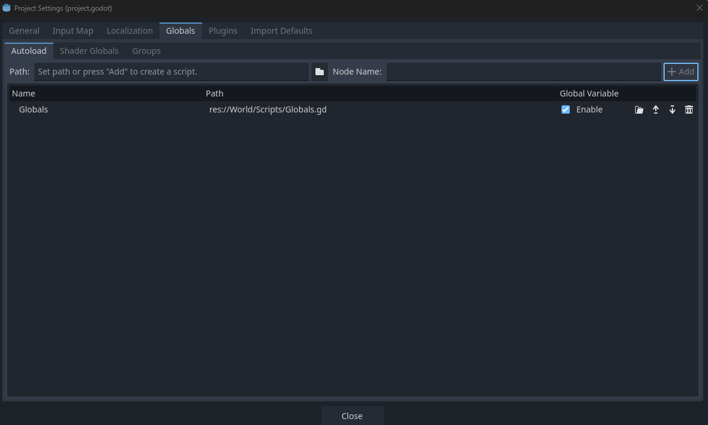

Click on "Close" to return to the project.

Last step before we test! We're going to add a small script to the `World` node to use the Globals script. This isn't necessary at this step, but let's do this to make sure the Globals works.

In the "Scene" window, make sure the `World` node is selected and click the "Add new script" button.

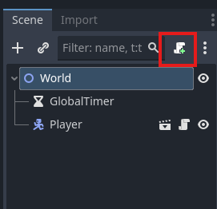

Click the "Create" button and the code editor should open the `world.gd` script in the code editor. We're going to use the simple code below to just set the variables that we created in the `Globals` area with the set_x commands. Paste this code into the world.gd file and save it.

```
extends Node2D

func _ready() -> void:
	Globals.set_world($".")
	Globals.set_player($Player)
	Globals.set_global_timer($GlobalTimer)
```

Now we're going to press F5 to run the game. Since we haven't selected a main scene yet, Godot will ask for the main scene. You should have the "World" scene open right now, so you can click on "Select Current." If you do not have it open, click on the "Select" button, navigate to the "world.tscn" file in your project, and click "Open."

Your window should now have the "World" scene running in your game and you should see a Player idle in the game. Just like with the "Player Build 1" project, you won't see the player move around as you use the keys or joystick due to the camera. You can override this setting by clicking the "Override the in-game camera" button. Because there is no game world for this component, your Player is allowed to move off the screen and back onto it!

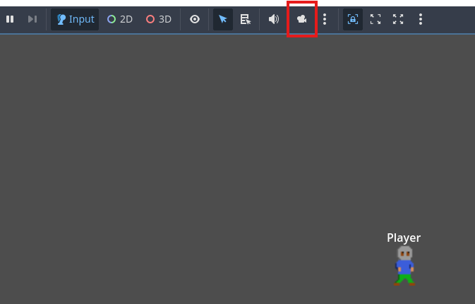

Happy Building and I'll see you for the next component build!

## Build 2
**Build 2 is in Godot 4.5.1**

For Build 2, we're adding the Generator to the project and generating a room. Now, the room will be more like something painted in, for the time being - the Player component does not have physics added to it. But, we are going to integrate the rendering. In the next couple of builds, we will add this functionality.

### Copy the Generator folder into the project

For the first step, copy the Generator component into your World project.


### Set Layer Names

Next, select the Project -> Project Settings menu. Navigate to the "Layer Names" section and click on "2D Render." Here, we're going to add the names of different nodes and the layer they will use. Enter "World" on Layer 1 and "Player" on Layer 3. Click "Close" when you are done.


### Update Globals.gd

Next, open the Globals.gd script. We're going to add in a variable and function to handle saving the generator. Add the following code at the bottom of the variable declarations.

```
var generator: Generator
```

And add the following function at the bottom of the file

```
func set_generator(inc_generator: Generator) -> void:
	generator = inc_generator
```

### Update the World scene

Next, open the World scene so that we can add the Generator to it. With the scene open, click and drag the `generator.tscn` file to the "World" node in your Scene window. Your scene should be updated to look like this:


Let's add some code to the the world.gd script. Open the script and add the following lines to the `_ready()` function.

```
	Globals.set_generator($Generator)
	Globals.generator.floor_generated.connect(_on_floor_generated)
	Globals.generator.floor_is_cleared.connect(_on_floor_cleared)
	Globals.generator.generate()
```

Also, add the following functions at the bottom of the file:

```
func _on_floor_generated() -> void:
	print("floor generated message received")
	

func _on_floor_cleared() -> void:
	print("floor cleared message received")
```

Your world.gd script should look like this:

```
extends Node2D

func _ready() -> void:
	Globals.set_world($".")
	Globals.set_player($Player)
	Globals.set_global_timer($GlobalTimer)
	Globals.set_generator($Generator)
	Globals.generator.floor_generated.connect(_on_floor_generated)
	Globals.generator.floor_is_cleared.connect(_on_floor_cleared)
	Globals.generator.generate()
	

func _on_floor_generated() -> void:
	print("floor generated message received")
	

func _on_floor_cleared() -> void:
	print("floor cleared message received")
```

Before we run this, we're going to make a small change to our Generator via the Inspector window. Click on the Generator in the Scene window and look at the Inspector window. We're going to change the Min Room Width and Min Room Height to 50. We're also going to update the Max Room Width and Max Room Heights to 75. Since these variables have been exported, we can make changes for the project we are working on without changing the code in the files. We will also turn on the "Draw Outline" setting. Your Inspector window should look like this.


### On to testing!

Run the game by pressing F5. Your game window should appear and look something like this


Move the player around to the right and down. You should see the size of your room that was drawn. You'll also see some blue lines, denoting the outside area for your game width and height.


Try out some other settings for the room generator and see how they work! Next, we'll add in some small changes to the generator, to select where the player starting location is, and to the player to keep the player from crossing the wall boundaries.

## Build 3

Build 3 is going to update the Player and the Generator components in your World project. One question you might have is "Why didn't we just do this work in the World project? We already have the Player and the Generator there." Well, yes, you could have. But, if you want to re-use these components, I find it easier to have their own project and folder structures that you can build and test in without having to load up your full game. Some of your games, like mine, will get quite large and this method makes updates to these smaller components faster. It also helps keep me focused on the change that I'm making, versus being distracted by a number of other changes.

Another challenge that updating the components in the World project is that you might accidentally tightly couple your component to the Game World or another component. This practice helps to avoid accidental cases where you reference either a property or a scene node that is not in the component. If you try to copy this component to another project, you might run into small things that need simple debugging to major refactoring to get the feature you want to work.

Before you open the World project in Godot, go to your Explorer, Finder, or other interface and copy the updated Player and Generator components into your World folder. Since our components are in their own sub-folders, this is simply copying the `Player` folder from your Player project and the `Generator` folder from your Generator project to your World project folder. Your file system should look like this:


Next, we're going to open up the `world.gd` file and start coding for our updated components! First, we'll add in a resource loader for our player_body.

Now, remove the line that reads `Globals.set_player($Player)` from this file. We're going to dynamically load the player into the game and remove it from the scene shortly.

After removing that line, let's update `_on_floor_generated` to instantiate the player, register it with Globals, initialize it, and set the location. The updated function should look like this.

```
func _on_floor_generated() -> void:
	print("floor generated message received")
	var player_resource: Node2D = preload("res://Player/player.tscn").instantiate()
	Globals.set_player(player_resource)
	Globals.world.add_child(Globals.player)
	Globals.player.initialize("player", 600, [], [2])
	Globals.player.set_location(Globals.generator.get_player_start())

```

---
**NOTE**

A few notes about using preload: Preload loads the object at compile time versus load, which loads at runtime. This allows the player to be ready faster. We are also doing the preload in the function where the player is needed for the time being. As we add enemies and enemy spawn points during a floor, it might be better to preload this one time for all those uses. Also, if we had more than one floor, it might be better to have the player loaded once.

Also, the resource loader returns an object of type "Resource," and not the class of the resource itself. Node2D gives the compiler that this is a Node2D-based object. We could have also used PackedScene for the compiler hint instead of Node2D.

---

Finally, open the World scene and remove the Player node. The updated scene should look like this.


Now save your project and run it with F5. You'll see your player is spawned into a room and can only move on the floor. The player is stopped at the wall.

## Build 4

Build 4 integrates the Player component that introduced Player types. We're going to spawn a player and an enemy into the same room.

### Update the Player

Before you open the project, copy the new Player component into the appropriate folder for your World project. Then, open the prooject.

If you open the `world.gd` file, you will see that we now get an error on the line for `Globals.player.initialize`. This is because we've added new parameters to the `initialize` function in the "Player" component. We will fix this line of code during our work integrating the new Player component.

### Update of Globals

Before we do, open the `Globals.gd` file. We're going to add a new member variable to Globals to hold the enemies. We want to have many enemies, so we're going to use an array to track them.

```
var enemies: Array[player_2d_body]
```

Next, we'll add a function to allow an enemy to be added to the array.

```
func add_enemy(inc_enemy: player_2d_body) -> void:
	enemies.append(inc_enemy)
```

Save the globals.gd file and let's move to update the World scene.

### Update of World scene

Before we add code to the world.gd file to spawn the Player and Enemy, we want to create an asset that will have the AnimatedSprite2D that we'll use for the Enemy characters. You might make many games and your enemies will probably need to look different. You might even make a boss enemy that looks drastically different for this game. This feature will help you to do that easily.

First, open the World scene and then click on the "World" node in the Scene window. Right click and choose "+ Add Child Node..." Search for "AnimatedSprite2D" and add it to the scene so that it looks like this.


Double click on the AnimatedSprite2D and rename it to "EnemySpriteAnimation"


In this repository, locate the folder /World/assets and copy the 4 PNGs located there to your projects World/asset folder. You will need to create this folder before copying the files.

Next, click on the EnemySpriteAnimation node and look at the Inspector window. We will need to add Sprite Frames to this object. Do so by clicking the down arrow that is highlighted below and selecting "New Sprite Frames."


Click on the field that reads "SpriteFrames" to open the Animations window on the bottom.


We are going to add the Animations for walk, down, up, and idle to this object using the assets we copied. First, click the "Add Animation" button 3 times so there are four animations listed. Then, rename the animations so it looks like this:


Next, we're going to add frames from sheet sheets. You will click the Add Frames From Sprite Sheet button, locate the appropriate enemy file in your "World/assets" folder and then select the animation frames to add. You might need to update the horizontal and vertical frames for the images. If you need a reminder of this, please see the [Player Build 1](https://github.com/timjbruce/godotbitesized_player/blob/main/readme.MD#build-1). Your end product should look similar to this:


Then, go back to the Inspector window and locate the Texture -> Filter setting. Change this value to "Nearest".


Finally, we want to hide this asset from within the World scene. In the Scene window, click the eye icon so that this is hidden.


### On to coding! Updates for the world.gd file

Open the `world.gd` file in the editor. We're going to make a few changes here so that we can spawn a player and an enemy in the same room. All of the changes are in `_on_floor_generated`. Let's walk through them

```
func _on_floor_generated() -> void:
	print("floor generated message received")
	var player_resource: PackedScene = preload("res://Player/player.tscn")
	var player: player_2d_body = player_resource.instantiate()
	Globals.set_player(player)
	Globals.world.add_child(Globals.player)
	var player_layers: Array[int] =  [3]
	var player_masks: Array[int] = [2, 4]
	Globals.player.initialize("player", 700, player_layers, player_masks, player_2d_body.PlayerType.Player, null)
	Globals.player.set_location(Globals.generator.get_player_start())
	var enemy: player_2d_body = player_resource.instantiate()
	Globals.add_enemy(enemy)
	Globals.world.add_child(enemy)
	var enemy_layers: Array[int] = [4]
	var enemy_masks: Array[int] = [2, 3]
	Globals.enemies[0].initialize("enemy_0", 300, enemy_layers, enemy_masks, player_2d_body.PlayerType.Enemy, $EnemySpriteAnimation)
	Globals.enemies[0].set_location(Globals.generator.get_player_start())
```

First, we changed the preload to not instantiate a player. This is because we'll use the same resource to create multiple instances. In the first lines, we create a player, add it to Globals, add it as a child, and then initialize it using variables along the way. Finally, we set its location. We do the same process with an enemy, and you can see we use different layers and masks. Basically, this will prevent the player from colliding with the enemy. In the initialization call, we pass the `$EnemySpriteAnimation` to it. As such, our enemy should come into this game with this green animation, versus our standard player animation. Let's try it by saving the project and running it.

There's probably some questions out there on the `initialize` call signature changing between versions and shouldn't components not have this issue. It does seem like this causes a level of coupling between the World and different components. Unfortunately, this is hard to avoid in Godot. Many languages offer what is called "overloading," or offering the same function name with different parameters. With overloading, we could create a second `initialize` function that would take the extra parameters and leave the first one in place. We could manage the missing values in script and this can get a bit messy, over time, if you don't do it well. Godot script, today, does not support overloading so we need to make a call between passing as a dictionary or passing by named variables.

Passing by dictionary can lead to a set of troubleshooting and researching while implementing a component or a component update. You need to know the name of the dictionary elements and the variable types. In the IDE in Godot, if you enter a function name that accepts a dictionary, the tooltip will show up that it needs to receive a dictionary and not all of these details. Additionally, you cannot use type hints today for every type of variable that could be passed in the dictionary. This leads to a subpar developer experience, imho.

I definitely prefer denoting variables and variable types in the function calls directly for these reasons. It allows a much tighter checking at compile time than defining and passing a dictionary, where many values might be incorrect or even missing. If this happens, your players might run into issues playing your games and become frustrated. 

<details>
<summary>Updated world.gd file</summary>

```
extends Node2D

func _ready() -> void:
	Globals.set_world($".")
	Globals.set_global_timer($GlobalTimer)
	Globals.set_generator($Generator)
	Globals.generator.floor_generated.connect(_on_floor_generated)
	Globals.generator.floor_is_cleared.connect(_on_floor_cleared)
	Globals.generator.generate()


func _on_floor_generated() -> void:
	print("floor generated message received")
	var player_resource: PackedScene = preload("res://Player/player.tscn")
	var player: player_2d_body = player_resource.instantiate()
	Globals.set_player(player)
	Globals.world.add_child(Globals.player)
	var player_layers: Array[int] =  [3]
	var player_masks: Array[int] = [2, 4]
	Globals.player.initialize("player", 700, player_layers, player_masks, player_2d_body.PlayerType.Player, null)
	Globals.player.set_location(Globals.generator.get_player_start())
	var enemy: player_2d_body = player_resource.instantiate()
	Globals.add_enemy(enemy)
	Globals.world.add_child(enemy)
	var enemy_layers: Array[int] = [4]
	var enemy_masks: Array[int] = [2, 3]
	Globals.enemies[0].initialize("enemy_0", 300, enemy_layers, enemy_masks, player_2d_body.PlayerType.Enemy, $EnemySpriteAnimation)
	Globals.enemies[0].set_location(Globals.generator.get_player_start())
	

func _on_floor_cleared() -> void:
	print("floor cleared message received")

```

</details>


### Voila!

You might have to move around a bit in your room, depending on the settings and spawn locations, but you should see output similar to this.


In the next lesson, we're going to add some more features to the player